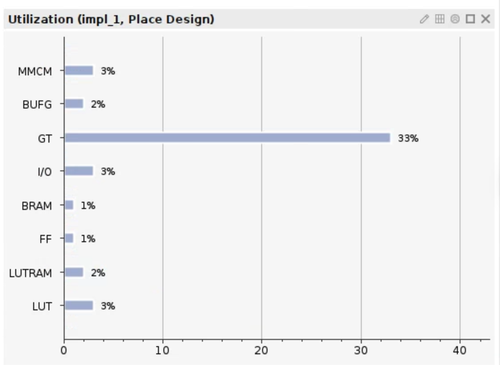
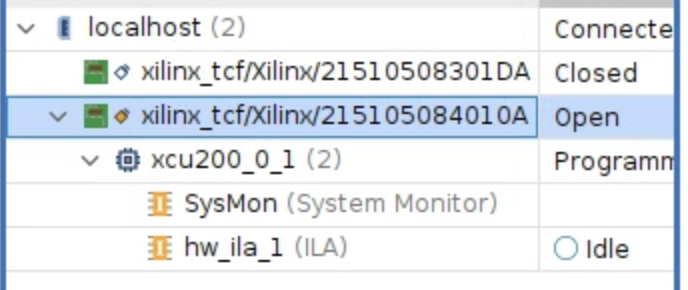
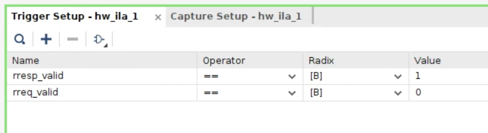
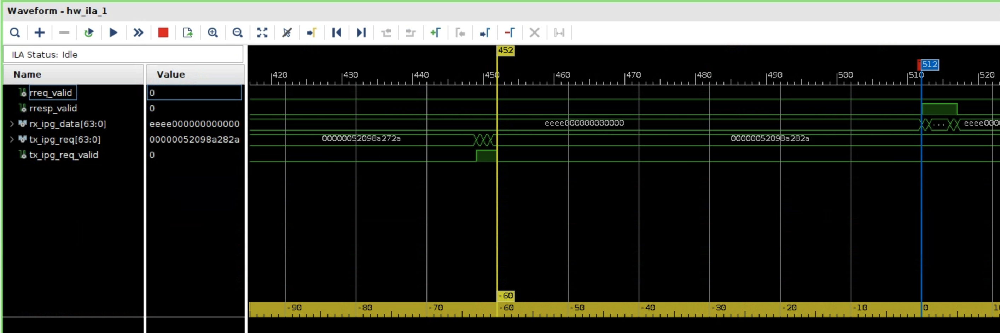

# Hardware verification
This repository provides a verilog implementation of EDM's host network stack in PHY layer.

## Overview
In this part, we present the implementation of EDM host stack, along with a demo application. We implement EDM host stack within the 25G Ethernet PHY. The application has both Tx and Rx module. The Tx is a request generator that repetitively sends RREQ blocks while the Rx responds with RESP blocks.

For artifact evaluation, we provide a server and hardware setup of a single two-port FPGA with loopback connection.


## Instruction
We first build and program EDM to FPGA board, then collect waveform from running hardware. 

#### 1. Build project
Go to project folder and run make. This will synthesize, implement and generate the bitstream, which takes about an hour.
```
 cd EDM-PHY/example/AU200/ae_test/ 
 make
```
open_project fpga.xpr


#### 2. Resource usage
1. Open Vivado,    
```
 vivado -nojournal -nolog
```
2. Open project in '_EDM-PHY/example/AU200/ae\_test/fpga/fpga.xpr_'.

3. Go to `Project Summary`, resource usage is as shown.



#### 3. Program FPGA and collect waveform
In this step, we will use the generated bitstream to program EDM onto Xilinx AU200 FPGA board and obtain results.

1. Open hardware manager and select target.   
    For AE reviewer using our server: There might show two boards available. Please select **215105084010A**. 
2. Program device. The .bit and .ilx file are in `EDM-PHY/example/AU200/ae_test/fpga/fpga.runs/impl_1/fpga.bit`. 
3. After programing, an ILA window should appear. Add all signals to the waveform.
4. Set up trigger and run:


5. As EDM permits blocks interleave, which might make waveform complex. We can run multiple times to sample a clean snapshot like below:  


## Waveform intepretation
In the application top module, the output of Tx is `tx_ipg_req` and the input of Rx is `rx_ipg_data`. Once Rx receives a RREQ, it generates response from on-chip BRAM and sends back to Tx.

Specifically, we observe a **60~62cycle** gap in between the last frame of `tx_ipg_req` and the first frame of `rx_ipg_data`. The variation is due to bitslip in Ethernet PMA's gearbox module.

The observed latency is much smaller than our paper, where we show EDM's roundtrip for read is ~300ns. This is because our testbed does not contain a switch, so we should remove components accordingly:
```
    real = expect - switch - 4*xcvr - 2*propagation
         = 299.44 - (4*5.12+28.16) - 4*19 - 2*10
         = 154.8 ns
```
Our prototype runs at 25Gbps, where the clock rate is 390.625mHz (2.56ns). So the observed latency translates to `153.6~158.72ns`.


